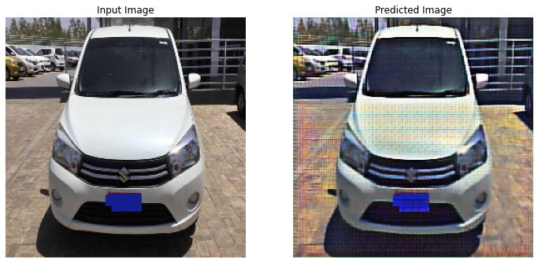
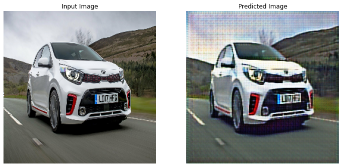
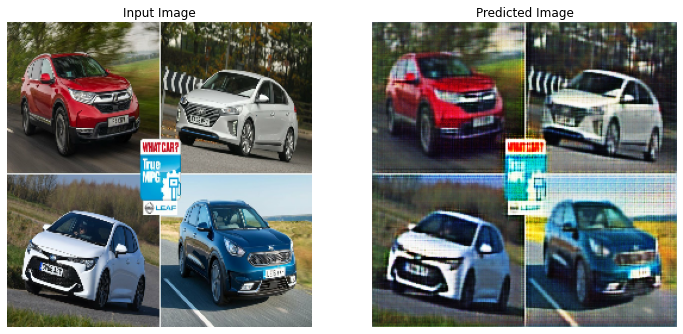
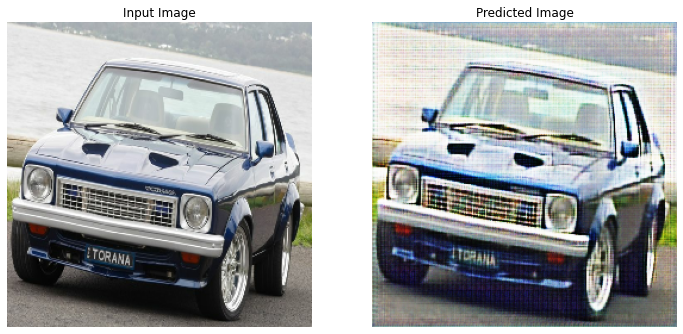
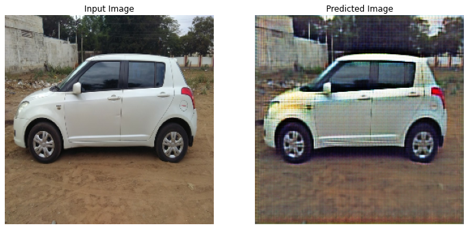
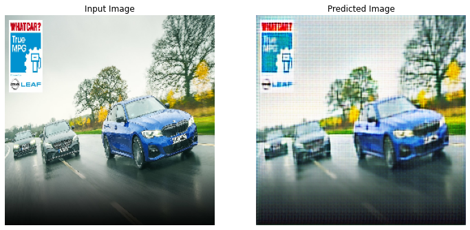
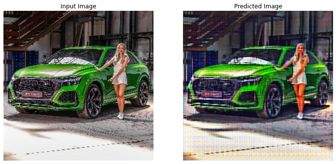

# CRYPT PROJECT - Pixel Art Generation And GameDev On Pixelated Images
Pixelated images of usual images give a different perspective to the image

With the help of machine learning this can be achieved

## Datasets used - 

datset1 - https://www.kaggle.com/adhith1/d1d1d1

datset2 - https://www.kaggle.com/adhith1/assetsss?select=Sprites

dataset3 - https://www.kaggle.com/adhith1/freetype

### Training -

https://www.kaggle.com/adhith1/aaaaaa

https://www.kaggle.com/adhith1/newtrain?select=trr1

https://www.kaggle.com/adhith1/d1d1d1

## Best results with -

Dataset - https://www.kaggle.com/adhith1/checking

### Training 

Set 1 - https://www.kaggle.com/adhith1/newtrain?select=trr2

Set 2 - https://www.kaggle.com/adhith1/d1d1d1

Epochs - 2

Lambda - 10

Batch Size : 10 for both the labels (though can be kept different)

## Outputs

