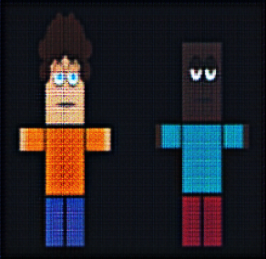
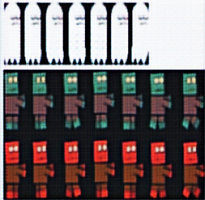
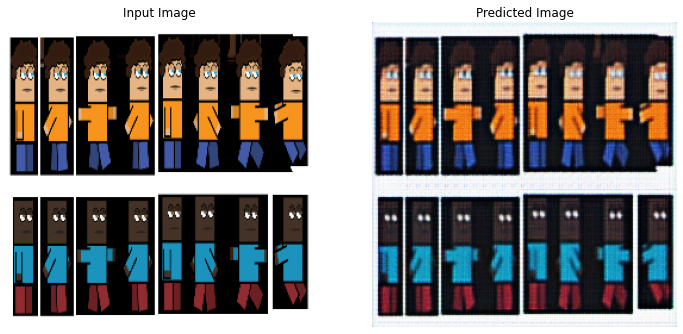
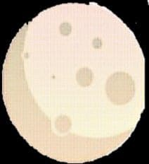
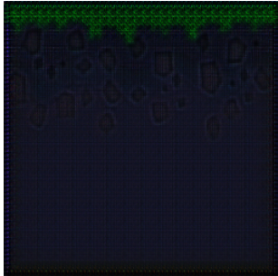
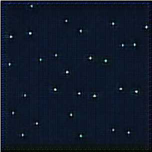

# MONSTERS IN PIXELS

This is a simple game created using unity and the assets used in the game were pixelated using the pixel-art-gen project.
 
It includes two characters that are made to jump over sprites and monsters in order to survive.

## Assets used 

## Gameplay

https://user-images.githubusercontent.com/84474888/152501974-2572c7c3-a879-423d-bced-f14dc8785201.mp4

(P.S) The blur on the bottom right is some screen recording error
